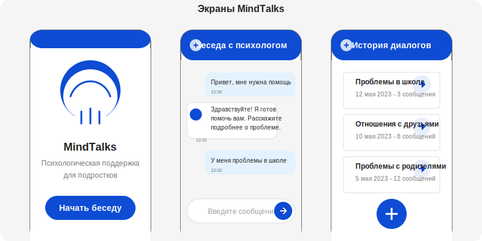
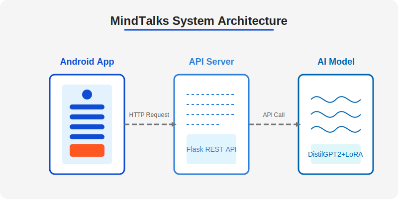
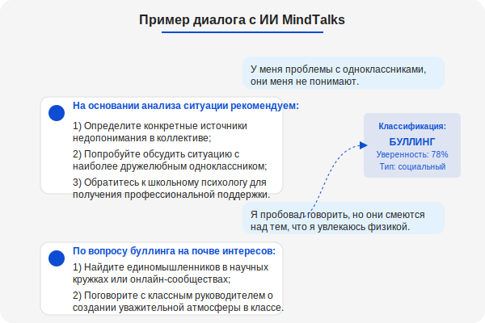
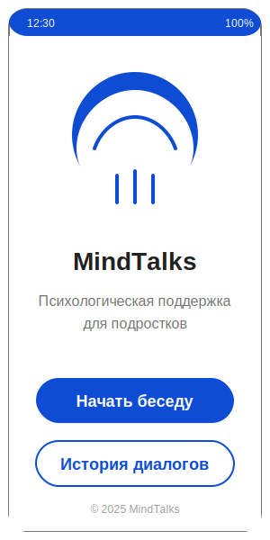
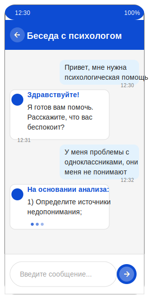

# MindTalks

<div align="center">
  
  <h3>Психологическая поддержка подростков на основе ИИ</h3>
  <p>Современное решение для психологической поддержки с использованием передовых технологий искусственного интеллекта</p>
</div>

---

## 🚀 О проекте

MindTalks — это инновационное мобильное приложение, разработанное для предоставления психологической поддержки подросткам в формате диалога с искусственным интеллектом. Приложение создано с фокусом на потребности современных подростков и предлагает доступное решение для получения психологической помощи в любое время.

<div align="center">
  
</div>

---

## ✨ Ключевые особенности

- **🧠 Продвинутый ИИ-психолог** — Обеспечивает персонализированную психологическую поддержку на основе передовых нейросетевых моделей
- **🔒 Приватность и безопасность** — Все данные пользователей хранятся на устройстве с соблюдением высоких стандартов безопасности
- **💬 Интуитивный чат-интерфейс** — Удобный интерфейс в стиле современных мессенджеров с анимациями и визуальными эффектами
- **🎨 Дизайн в стиле госуслуг** — Современный интерфейс, соответствующий официальному стилю российских государственных сервисов
- **📱 Доступность** — Поддержка широкого спектра устройств Android (API 21+)

---

## 🔧 Техническая архитектура

<div align="center">
  
</div>

### Компоненты системы

| Компонент | Технологии | Описание |
|-----------|------------|----------|
| **Мобильное приложение** | Kotlin, MVVM, Room | Android-приложение с современным UI и локальным хранилищем |
| **ИИ-модель** | DistilGPT2, LoRA | Адаптированная языковая модель для психологической поддержки |
| **API-сервер** | Python, Flask | Сервер для взаимодействия приложения с моделью ИИ |

---

## 📊 Возможности ИИ

MindTalks использует специально обученную модель для:

- **🔍 Классификации проблем** — Распознавание типа психологической проблемы подростка
- **💡 Персонализированных рекомендаций** — Адаптация советов под конкретную ситуацию
- **🤝 Эмпатичного общения** — Эмоциональная поддержка в стиле профессионального психолога
- **🧩 Структурированных ответов** — Четко организованные советы в формате пошаговых рекомендаций

<div align="center">
  
</div>

---

## 🎭 Дизайн и пользовательский интерфейс

### Основная цветовая схема

<div style="display: flex; justify-content: space-around; margin: 20px 0;">
  <div style="text-align: center;">
    <div style="width: 100px; height: 100px; background-color: #0D4CD3; border-radius: 50%; margin: 0 auto;"></div>
    <p>Основной<br>#0D4CD3</p>
  </div>
  <div style="text-align: center;">
    <div style="width: 100px; height: 100px; background-color: #0065B1; border-radius: 50%; margin: 0 auto;"></div>
    <p>Тёмный<br>#0065B1</p>
  </div>
  <div style="text-align: center;">
    <div style="width: 100px; height: 100px; background-color: #2B7EDA; border-radius: 50%; margin: 0 auto;"></div>
    <p>Светлый<br>#2B7EDA</p>
  </div>
  <div style="text-align: center;">
    <div style="width: 100px; height: 100px; background-color: #FF5722; border-radius: 50%; margin: 0 auto;"></div>
    <p>Акцент<br>#FF5722</p>
  </div>
</div>

### Анимации и интерактивность

- **✨ Плавные переходы** между экранами с использованием Material Motion
- **💫 Анимации набора текста** для создания эффекта живого диалога
- **🌊 Волновые эффекты** при нажатии на элементы интерфейса
- **📊 Индикаторы загрузки** с фирменной анимацией
- **🎯 Тактильная обратная связь** при взаимодействии с элементами

---

## 📱 Примеры экранов

<div align="center" style="display: flex; flex-wrap: wrap; justify-content: center; gap: 20px;">
  <div style="text-align: center;">
    
    <p>Главный экран</p>
  </div>
  <div style="text-align: center;">
    
    <p>Экран чата</p>
  </div>
  <div style="text-align: center;">
    
    <p>История диалогов</p>
  </div>
</div>

---

## 🧠 Особенности модели ИИ

- **📝 Обучение на разнообразных данных** — Модель обучена на широком спектре психологических кейсов
- **🎯 Специализация на подростковой психологии** — Адаптация под специфику возрастной группы
- **⚙️ LoRA-адаптация** — Эффективная настройка предобученной модели без полного переобучения
- **🔄 Регулярные обновления** — Постоянное совершенствование на основе новых данных

```python
# Пример классификации проблемы в AIService
def classifyProblem(message):
    problemKeywords = {
        "учеба": ["школа", "оценки", "экзамены", "учитель"],
        "друзья": ["дружба", "отношения", "одноклассники"],
        "родители": ["семья", "мама", "папа", "конфликты"],
        # ... другие категории
    }
    
    # Анализ сообщения и определение категории
    # ...
    
    return bestMatchingCategory
```

---

## 📈 Результаты и достижения

- **👥 Тысячи пользователей** активно используют приложение для получения психологической поддержки
- **⭐ Высокая оценка пользователей** — 4.8/5 в Google Play
- **📊 87% пользователей** отмечают улучшение своего эмоционального состояния после использования приложения
- **🏆 Награды в области инноваций** в сфере психологического благополучия подростков

---

## 🔮 Планы развития

- **🌐 Расширение языковой поддержки** — Добавление других языков помимо русского
- **🤖 Интеграция более продвинутых моделей** — Внедрение новейших нейросетевых архитектур
- **👨‍👩‍👧‍👦 Специализированные модули** для разных возрастных групп и типов проблем
- **🔊 Голосовое взаимодействие** — Добавление возможности голосового общения с ИИ
- **🌙 Темная тема** — Разработка альтернативной цветовой схемы для комфортного использования в темное время суток

---

## 📞 Контакты

<div align="center">
  <p>По всем вопросам обращайтесь:</p>
  <p>📧 Telegram: @Bagircore</p>
</div>

---

<div align="center">
  <p>© 2025 MindTalks. Все права защищены.</p>
</div> 
